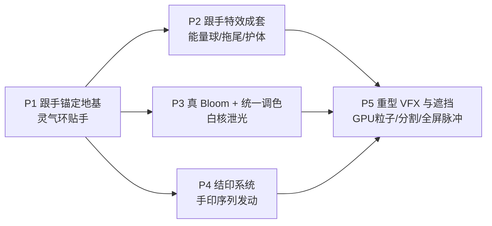

# AuraSeal 改造计划 · 跟手 + 结印 + 电影级特效

> 生成日期:2026-06-20 · 基于真机反馈:"效果很烂,没有跟随手,要结印,要有电影那样的特效"
> 现有 v0.2~v1.1 已上线,本计划是在其之上的**聚焦重构**,不推倒重来,旧链路全程作保命回退。

 

---

## 目标体验(North Star)

举手 → 掌心**实时浮现旋转灵气环并贴手移动**;双掌靠近 → 中点凝聚一颗会呼吸的能量球随开合缩放;食指划动 → 指尖拖出余晖飘带;**快速连结一串忍者手印拼出咒语 → 发动镜头级大招** —— 真 bloom 泄光、GPU 粒子、边缘溶解、人体遮挡,整画面(含摄像头)统一电影调色。

## 三大诉求拆成的根因

| 诉求         | 现状根因(真实代码)                                                                                                                                                           | 落点        |
| ------------ | ---------------------------------------------------------------------------------------------------------------------------------------------------------------------------- | ----------- |
| **没有跟手** | landmark 只喂给手势识别,被节流到 3Hz 进 React;特效在 trigger 时把 anchor **一次性烧死成世界坐标**,`updateWebGLEffect` 只按 progress 播完就 dispose,`group.position` 永不更新 | **P1+P2**   |
| **要结印**   | 现有 12 个手势是**粗几何**(合十/推掌…),没有逐指手形分类,没有手印序列                                                                                                         | **P4**      |
| **电影级**   | `MeshBasicMaterial + 全局 AdditiveBlending`,**无真后处理 bloom**,正交 2D 贴片层,与人体无遮挡                                                                                 | **P3+P5**   |
| **隐藏坑**   | 摄像头 `scaleX(-1)` 镜像但特效层不镜像 + `object-fit:cover` 裁切 —— 离散特效放一下看不出,**一旦跟手就会系统性偏离手**                                                        | **P1 先修** |

---

## 五条指导原则

1. **每阶段都不破坏现有可跑状态**:transient 11 特效 + 4 combo + 全身手势链路全程零回归,新能力走并行新通道(`landmarkRef` / `onSeal` / `fxTier`),旧路径永远是保命回退。
2. **优先做用户一眼能感知的**:跟手锚定(P1)和真 bloom(P3)最快出肉眼效果,排在结印与重 VFX 之前;每阶段必有可真机眼检的独立产出。
3. **三大诉求相互衔接**:跟手锚定(P1)是结印发动定位、拖尾、电影级渲染锚点的**共同地基**;先打地基,再分别长出结印(P4)与重 VFX(P5)。
4. **性能用 fxTier 档位闭环兜底**:所有新增 attached 特效/后处理/粒子/遮挡都按设备分档降配,低端机自动退回无后处理静态路径,绝不陷入降级抖动循环。
5. **坐标系一次性修对并共享**:镜像+cover 映射做成纯函数单测覆盖,同时回填 transient,杜绝"跟手系统性偏移"这一最易翻车点。

---

## 路线图总览

排序逻辑:**P1 是公共地基**(新增的逐帧 `landmarkRef` 通道、`anchors.ts`、`coordMap.ts` 被后面全部复用,且做一个灵气环就能让你立刻看到改善)。P3 真 bloom 排在重 VFX 前,因为白核泄光是"电影级"最直观一跳。P4 结印依赖 P1 的逐帧 landmark 但与渲染解耦,可与 P3 并行。P5 最贵(GPU 粒子/分割遮挡)放最后,前四阶段认可后再压上去。

---

## P1 · 跟手锚定地基

**目标**:把逐帧 landmark 接进特效层,做出第一个肉眼可见、实时贴手移动的**灵气环**。这是后续一切的地基,也是最快的改善。

**任务**

- `useVisionLoop.ts` 新增高频 `landmarkRef`(`useRef<FrameFeatures+quality>`),在 `loop()` 每个检测 tick **裸写、绕过 React 节流**;hook 返回并由 AuraSealApp 透传给 EffectCanvas。
- 新建 `src/effects/coordMap.ts`:`mapToCanvas(norm, frame, w, h)` 纯函数 = `x'=1-x` 镜像 + `object-fit:cover` 裁切还原 + 乘画布;加 cover 边界单测;**回填 `toWorld` 修掉 transient 现有镜像/裁切错位**。
- 新建 `src/effects/anchors.ts`:`AttachAnchorKind`(hand_center / hand_palm_dir / fingertip_index / palms_midpoint / body_core)+ `resolveAnchor(kind, frame)`,复用 `gestures.ts` 的 landmark 索引与 `handOpenness`。
- 扩展 `WebGLEffectActor`:`mode('transient'|'attached')` / `attachAnchor` / `attachUpdate` / `fade` / `lastSeenMs`;`baseActor` 默认 transient 保证零回归。
- 新增 `smoothDamp` 临界阻尼弹簧(tau≈55ms,按实测检测间隔自适应)补 15Hz→60Hz;实现 `createAuraRing`(掌心灵气环,position 每帧设为映射世界坐标,旋转随时间,scale 随手张合)。
- `EffectCanvas` 的 60fps draw loop 内:读 `landmarkRef` → resolveAnchor → mapToCanvas → smoothDamp → 更新 attached actor;transient 分支完全不变;attached 独立池不占 `actorCap`。

**验收**:举手时灵气环实时贴掌心跟随、**无镜像/裁切偏移**、延迟可接受;手出框平滑淡出、回来淡入不瞬灭;现有 11 特效+4 combo 位置零回归;coordMap 单测通过。
**你来眼检**:灵气环贴不贴手、有没有偏移、延迟能否接受;手快挥 vs 静止的外推手感(有无黏滞拖影/抖动)。

---

## P2 · 跟手特效成套

**目标**:把单个灵气环扩成完整跟手家族,坐实"跟手"。

**任务**

- `createPalmOrb`(双掌能量球):锚 `palms_midpoint`,用双腕距离反向驱动 scale 与亮度——**双掌越近球越亮越紧实**;仅双手够近时挂载。
- `createFingerTrail`(指尖拖尾):定长 ring buffer(N=24,低档 10),复用 `createRibbonMesh`(已支持头宽尾窄)只更新同一 BufferGeometry 的 position,尾端 alpha 衰减。
- `createBodyAura`(护体斗气):锚胸口、半径∝肩宽,粒子壳包裹躯干;格斗架势时挂载。
- 新建 `src/effects/attachedManager.ts`:输入 frame 输出应存在的 attached 列表;用 `handedness`+上一帧最近邻做**稳定 id 防左右手互换**;仅拓扑变化更新 React。
- quality level 写进 `landmarkRef`,各工厂按档降配(低档关 body_aura、砍粒子、拖尾减短)。

**验收**:双掌靠近凝聚能量球随开合缩放变亮;双手快速移动左右手特效不互换;指尖拖尾平滑头宽尾窄;长时间运行内存稳定不泄漏。
**你来眼检**:能量球开合手感、双手快移是否错位、拖尾是否平滑、手部短暂丢失是否频繁闪烁。

---

## P3 · 真 Bloom 与统一调色

**目标**:上 `EffectComposer + UnrealBloom + 视频进场景`,让白核真正向四周泄光、整画面统一 ACES 调色 —— "电影级"最直观一跳。

**任务**

- 新建 `src/effects/pipeline/CinematicPipeline.ts`:`EffectComposer + RenderPass + UnrealBloomPass(threshold≈0.85) + OutputPass`;renderer 改 HalfFloat target + `ACESFilmicToneMapping`;draw 里 `renderer.render` → `composer.render`。
- **视频进场景**:全屏 Plane + `VideoTexture(camera.videoRef)`,shader 内做镜像替代 CSS;`RenderPass(videoScene)` → `RenderPass(fxScene, clear=false)` 合到同一 HDR buffer(透明叠加层做 bloom 泄到 alpha=0 几乎看不见,**必须先把视频纳入合成域**)。
- `OrthographicCamera` → `PerspectiveCamera` + z=0 标定层(1 单位≈1px),让 P1 的 mapToCanvas 尽量不改即可复用,为后续景深/遮挡留 z 深度。
- `capture.ts`/`useRecorder` 改读 composer 输出 canvas(已含视频),校验截图/录制为完整合成不黑屏不缺层。
- `fxTier` 闭环:tier0/1 full composer;tier2 bloom 半分辨率;**tier3 跳过 composer 回退旧 `renderer.render`(保命路径)**。

**验收**:发招白核真泄光(对比改造前贴片软盘肉眼可见差异);正交→透视切换后所有特效位置不错位;截图/录制含完整合成;tier3 回退与旧版一致无回归。
**你来眼检**:白核是否真泄光而非贴片;截图录制是否含完整合成;中低端机帧率是否击穿、退档是否平滑。

---

## P4 · 结印系统

**目标**:忍者手印识别 + 序列发动 —— 快速连结一串手印拼咒语发动大招,HUD 实时印链反馈,**与现有粗手势并存**。

**任务**

- 新建 `src/vision/seals/handFeatures.ts`:`extractHandPose(hand[21])` 算每指 flexion 夹角、伸/屈 bitmask、palmSize 归一化、facing(z 软特征低权重);补单测。
- `sealTypes.ts`(子/午/卯/酉/寅/辰 六印 + 字形)+ `sealClassifier.ts`:先 **5-bit bitmask 汉明距≤1** 查表,再用 flexion 模板余弦相似度算 confidence(模板常量预留可换 KNN)。
- `sealStabilizer.ts`:3 帧确认 + conf>0.6 + EMA,同印不重复 emit 直到换印/松手,**无 1450ms 冷却**(结印要快)。
- 新建 `src/play/seals.ts`:`SEAL_SPELLS` 咒语表(4-6 条,如 火遁=卯→午→子→冲击波)+ `SealSequencer` 前缀匹配 + 1800ms 窗 + 700ms 松手清链;补单测。
- `useVisionLoop` 接**并行结印支路**(`sealStabilizerRef`),走新 `onSeal` 回调;结印部分 snapshot 提频到 ~100ms;`GestureStabilizer` 链路完全不动。
- 新建 `src/ui/SealChainHUD.tsx`:横排印槽(复用 `SealMark` 视觉),已结印高亮 + 当前印 confidence 进度环 + 下一印虚影 + 印名;发动有专属横幅+音效。

**验收**:六印真机可稳定区分,相邻印误判率可接受;快速连 3-5 印在 1800ms 内拼出咒语发动;HUD 不挡脸;与粗手势并存无双触发。
**你来眼检**:六印在你手上能否稳定区分、相邻印误判;连印拼咒语手感(1800ms 够不够);HUD 在真实画面上的可读性。

---

## P5 · 重型 VFX 与遮挡

**目标**:补齐电影级最后一层 —— GPU 粒子、跟手 ribbon 拖尾、边缘溶解材质、**人体分割遮挡**、全屏冲击脉冲。

**任务**

- `ParticleSystem.ts`:`InstancedMesh + ShaderMaterial`,GLSL 内联 curl-noise 速度场、size/color over life、火花/烟雾 atlas(缺资产退程序化 sprite);发射原点接 `landmarkRef`。
- `ScreenFxPass.ts`(ShaderPass):放射状冲击模糊 + RGB 色散 + 暗角 + lift/gamma/gain+hue(接 customHue);发招脉冲拉满后指数衰减(复用 `burstCurve`)。
- `DissolveMaterial.ts`:noise alpha clip + fresnel 发光边,`uThreshold` 随 progress 控生灭;替换 ring/disc/wedge 的 MeshBasicMaterial。
- **人体分割遮挡**:`useVisionLoop` 隔帧调度加 `ImageSegmenter`(selfie 模型,~5-8Hz,仅 tier0/1)出 person mask → DataTexture → mask-alpha 合成,实现人从光球前走过被挡住;mask 时间平滑减抖。
- 把 P2 的拖尾升级为 `TrailRibbon.ts`(catmull-rom 重采样 + 沿 t 带宽/alpha 渐隐)。
- 降级闭环并入后处理 tier;扩展 `StatsOverlay` 显示 composer pass 耗时/粒子数/bloom 分辨率。

**验收**:人从能量球/光柱前走过被身体挡住、mask 边缘不过度抖动;发招全屏一次径向模糊+色散+暗角脉冲;中低端机不击穿、退档平滑;无内存泄漏。
**你来眼检**:遮挡是否生效、mask 抖不抖;全屏冲击强度到位但不晕眩;拖尾残影是否实时跟手不反向;中低端机帧率。

---

## 关键风险与缓解

| 风险                                                                                                                                | 缓解                                                                                                                                      |
| ----------------------------------------------------------------------------------------------------------------------------------- | ----------------------------------------------------------------------------------------------------------------------------------------- |
| **镜像+cover 坐标映射算错** → 所有跟手特效系统性偏离手,回填还可能动到旧效果位置(最易翻车)                                           | `mapToCanvas` 做纯函数 + cover 边界单测;P1 先在单个灵气环验证映射再铺开;回填后逐一真机比对 11 特效;P3 透视切换复用同一标定层              |
| **HDR + 多 pass composer + bloom 在移动端/集显击穿帧率**,叠加分割推理更卡                                                           | 严格 `fxTier` 闭环,**tier3 完全跳过 composer 回退旧路径**;ImageSegmenter 仅 tier0/1;StatsOverlay 真机标定阈值                             |
| **MediaPipe z 噪声大、双手顺序跳变** → 结印 facing 不可靠、左右手特效互移、相邻印误判                                               | 结印主靠逐指伸/屈 bitmask(鲁棒),z 仅低权重;attached 用 handedness+最近邻稳定 id;SealStabilizer 3 帧确认+去抖;**这些阈值必须真机反复调参** |
| **15Hz→60Hz 外推 tau**:太大手快移黏滞、太小静止抖;低端降到 ~5Hz 结印 1800ms 内结不完                                                | smoothDamp 按实测检测间隔**自适应 tau**;结印激活期临时提高手部检测占比;两种场景都要真机眼检                                               |
| **改单一合成域后截图/录制依赖 preserveDrawingBuffer** → 若 composer 用 MSAA/多 target,readback 那张 canvas 不是最终输出 → 黑屏/缺层 | P3 明确让 composer 最终输出落到 preserveDrawingBuffer 那张 canvas;capture 改读它并把"不缺层"列入 P3 强制验收                              |

---

## 建议:从 P1 开始

P1 一个阶段就能让你看到"灵气环实时贴手"的肉眼改善,且它是后面全部的地基。每个阶段我做完都会让你真机眼检,你认可了再压下一阶段 —— 绝不一口气堆五层让你最后发现方向不对。
