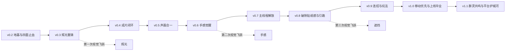

# AuraSeal 灵印引擎 · 长期发展路线图(10 大版本)

> 生成日期:2026-06-19 · 基线:`codex/aura-seal-mvp`(MVP,未提交)
> 本文基于对当前代码库的逐文件审计(VFX / UI / 功能 / 性能 四维)合成,所有诊断均可回溯到具体 `file:line`。

   

---

## 0. 北极星(North Star)

**AuraSeal = 一个隐私优先(本地推理零上传)、国漫/格斗番级的实时 AR 能量特效创作与社交产品。**

用户对着摄像头结印出招 → 本地实时识别手势/姿态 → 叠加带 **bloom 辉光、语义化色板、charge→burst→dissipate 三段式打击节奏、人体遮挡锚定**的电影级特效 → 出招有低延迟音效 → 一键录制带声成片加品牌水印分享到抖音/小红书/微信 → 具备连招/计分/每日挑战玩法、可调色换肤与本地作品库 → 支持同屏乃至远程双人隔空对战 → 桌面 ≥30fps、移动 ≥24fps 稳定运行。

> 一句话:**让任何一次出招都"足够炸到可以截一张图、录一段视频发出去"。**

---

## 1. 现状诊断:你的四个抱怨 = 四个结构性根因

| 抱怨         | 不是"调参问题",而是结构性缺失                                             | 关键证据                                                                                                                                             | 首批止血落点                                                             |
| ------------ | ------------------------------------------------------------------------- | ---------------------------------------------------------------------------------------------------------------------------------------------------- | ------------------------------------------------------------------------ |
| **动效垃圾** | 全局加色混合 + 零后处理 + 两色硬锁 + 2D 贴片层                            | `webglRenderer.ts:530` 所有 Mesh 强制 `AdditiveBlending`;全仓无 `EffectComposer/Bloom`;`presets.ts` 全表青+红;`EffectCanvas.tsx:57` 正交 2D 层无遮挡 | **v0.3** bloom + 混合策略 + 语义色板 + 接通 `intensity`                  |
| **UI 垃圾**  | 零设计 token + Inter 根本没加载 + 首屏空房间 + 无障碍裸奔                 | `grep --space/--radius/--font` = 0;`8px` 圆角 16 处;`index.html` 无字体引入;面板默认 `useState(false)`                                               | **v0.2** token 基座 + 自托管字体 + focus-visible + 首屏提示条            |
| **功能垃圾** | 传播闭环 K=0 + 无音效 + 无持久化 + 无玩法                                 | `src/recording/` 仅 4 行占位;`grep MediaRecorder/blob/share` = 0;`audio:false`;`grep localStorage` = 0                                               | **v0.3** 一键截图 → **v0.4** 录制+分享 → **v0.5** 音效                   |
| **性能很差** | 双模型同帧串行阻塞主线程 + 特效零对象池 + fps 只当装饰 + 无 ErrorBoundary | `useVisionLoop.ts:128-129` 主线程串行 `detectForVideo`;每次 trigger `new Geometry/Material`;`fps` 算了没人用                                         | **v0.2** 隔帧检测+ErrorBoundary → **v0.3** 对象池 → **v0.7** Worker 解耦 |

> 关键洞察:**四样问题深度耦合**。bloom 必须先有后处理管线;人体遮挡必须先有 Worker(否则压垮主线程);录制成片必须在画面已经做炸之后才有意义。所以路线图严格按**技术依赖链**排序,杜绝依赖倒置。

---

## 2. 八条指导原则

1. **四面同时止血优先于单点惊艳** —— v0.2~v0.3 在每个维度都拿出肉眼可见改善,先让产品"不再像垃圾 demo"。
2. **传播闭环要早不要晚** —— 截图 v0.3 / 录制+分享+音效 v0.4~v0.5 闭合,远早于"先把特效做到极致再说"。被分享的内容质量可后续螺旋上升。
3. **严格遵守技术依赖链** —— bloom → 对象池 → 三段式 → Worker → 人体遮挡,杜绝依赖倒置。
4. **性能是贯穿全程的硬约束而非某一版功能** —— 每加一层负载,同版本内用隔帧/对象池/降级闭环把帧时间打回预算(桌面 30 / 移动 24fps)。
5. **移动端是 AR 自拍主战场,不能推到最后** —— 基础 `100dvh+safe-area+拇指热区` 从 v0.4 传播闭环上线就要可用。
6. **隐私是核心叙事而非默认事实** —— "本地推理零上传"必须在 UI、文案、同源自托管部署三处被用户用 devtools 验证。
7. **无障碍与工程基线是产品资格而非加分项** —— focus-visible/aria/对比度、lint/CI/ErrorBoundary 从 v0.2 起就是 CI 硬门槛。
8. **每个版本可独立交付独立验收,且不得让已有闭环退化** —— 先保证旧闭环不坏,再加新能力。

---

## 3. 路线图总览

```mermaid
gantt
  title AuraSeal 阶段划分(相对节奏,非绝对工期)
  dateFormat  X
  axisFormat %s
  section 止血与地基
  v0.2 地基与四面止血      :done, a1, 0, 1
  section 视觉与传播闭环
  v0.3 辉光重铸            :a2, 1, 2
  v0.4 成片闭环            :a3, 2, 3
  v0.5 声画合一            :a4, 3, 4
  v0.6 手感觉醒            :a5, 4, 5
  section 性能与体验深化
  v0.7 主线程解放          :a6, 5, 6
  v0.8 破除贴纸感与引路    :a7, 6, 7
  section 玩法与增长
  v0.9 连招与玩法          :a8, 7, 8
  v1.0 移动优先与上线毕业  :a9, 8, 9
  v1.1 群灵共鸣与平台护城河 :a10, 9, 10
```

| 版本     | 代号                 | 主题一句话                  | 核心交付                                                             |
| -------- | -------------------- | --------------------------- | -------------------------------------------------------------------- |
| **v0.2** | 地基与四面止血       | 工程基线 + UI/性能立刻止血  | CI / HTTPS 部署 / ErrorBoundary / 设计 token / 自托管字体 / 隔帧检测 |
| **v0.3** | 辉光重铸             | 第一次视觉飞跃 + 截图       | Bloom/HDR/混合策略 / 语义色板 / 接通 intensity / 对象池 / 一键截图   |
| **v0.4** | 成片闭环             | 传播闭环 K>0                | 录制管线 / IndexedDB 作品库 / Web Share / 移动端基础响应式           |
| **v0.5** | 声画合一             | 补齐另一半感官              | 特效音效 / BGM / 音轨 mux 进导出                                     |
| **v0.6** | 手感觉醒             | 第二次视觉飞跃(手感)        | charge→burst→dissipate 三段式 / 命中反馈 / motion trail / 湍流溶解   |
| **v0.7** | 主线程解放           | 攻克性能物理根因            | MediaPipe 迁 Web Worker+OffscreenCanvas / FPS 自适应降级 / 代码分包  |
| **v0.8** | 破除贴纸感与引路     | 第三次视觉飞跃 + onboarding | 人体分割遮挡 / 交互式首次引导 / 实时识别纠错                         |
| **v0.9** | 连招与玩法           | 从玩具到玩法                | 连招组合技 / 计分挑战 / 换肤调色 / 作品画廊                          |
| **v1.0** | 移动优先与上线毕业   | 可规模化上线产品            | 移动优先重排 / 性能预算看板 / 监控 / 品牌系统 / SEO+隐私收口         |
| **v1.1** | 群灵共鸣与平台护城河 | 网络效应与护城河            | 同屏→远程双人对战 / 社交裂变 / 特效编辑生态 / 变现                   |

---

## 4. 版本详述

### v0.2 · 地基与四面止血(Foundation & Stop-the-bleed)

> 一个版本内同时浇筑工程地基并对 UI/性能两条线立刻止血,把"用不起来"变成"能用",为后续一切改动铺好可验证可降级的脚手架。

**目标**:工程裸奔清零(提交/CI/部署/ErrorBoundary);UI 结构性止血(token+字体+焦点环+首屏提示);性能低成本止血(防白屏+隔帧+消除 layout thrash);隐私叙事落地(模型同源自托管)。

**工作流**

- **工程**:提交分支开 PR + `.gitignore` 排除 `CLAUDE.md/.claude`(不以 claude 作者形式提交);ESLint+Prettier+lint-staged+husky;GitHub Actions CI(typecheck→lint→test→build);AuraSealApp 外层 ErrorBoundary;`createWebGLEffect` 的 `switch` 补 `default`;监听 `webglcontextlost`;Vercel/Netlify 部署(HTTPS+SPA fallback+缓存头)。
- **UI**:设计 token 基座(`--space-1..6` 4px 基线 / `--radius-*` / `--text-*` / `--shadow-*` / 语义色);清除散落 hex;自托管字体(Inter+中文黑体可变字体,`font-display:swap`+preload,数字 `tabular-nums`);全局 `:focus-visible` + `aria-pressed` + 对比度复核;首屏底部常驻"手势提示条"(用已有 `confidence` 显示进度),删 1.77MB `gesture-guide.png` 换暗底 SVG 线稿。
- **性能**:hand/pose **隔帧交替检测**(单帧成本立刻减半);`ResizeObserver` 替换每帧 `getBoundingClientRect`;`load()` in-flight Promise 去重防 StrictMode 双初始化。
- **识别**:WASM 与 `.task` 模型**同源自托管**+preload+长缓存,加超时+指数退避,失败降级单 hand 模型。

**验收**:线上 HTTPS 可打开并跑通一次手势→特效、刷新无白屏;CI 四项全绿、main 受保护、commit 不含 claude 作者信息;制造 context lost/未知 preset 显示降级 UI;断网有可点重试;字体确实加载(非系统降级);全站引用 token、键盘 Tab 可见焦点。
**指标**:CI 通过率 100% · 首屏白屏/崩溃率 0 · 弱网模型加载成功率 ≥95% · Lighthouse A11y ≥90。

---

### v0.3 · 辉光重铸(Glow Reforge)— 第一次视觉飞跃

> 重建带 bloom/HDR/混合策略/语义色板的现代渲染地基,把"几何描边+全局加色"的 Flash 观感升级为"核心过曝高光+中频色彩层+暗部描边"的国漫光效结构;同步落地对象池兜底后处理负载;交付传播闭环第一块拼图——一键截图。

**工作流**

- **VFX**:接入 `postprocessing` EffectComposer(RenderPass+UnrealBloomPass),核心渲染到 HDR float target;重构混合模式(实体/暗部/描边 `NormalBlending`,仅高光芯+火花 `AdditiveBlending`,加色层加径向 alpha falloff 防死白);把 `preset.intensity` 接到 bloom strength + emissive + 初始 scale;**色板系统**(每 preset 升级为 core/mid/rim/spark/glow 多色 + gradient ramp,按手势语义分火/雷/气/冰/暗);高光 `#ffffff` 改带色温近白 HDR;轻量 chromatic aberration + vignette。
- **性能**:几何体/材质缓存 + 共享 ShaderMaterial + InstancedMesh;actor **对象池**,超限改 fast-dissipate 自然退场而非瞬删。
- **功能**:一键截图(video 当前帧 + WebGL 帧合成离屏 canvas,导出带水印 PNG,对齐特效峰值帧);预览卡可下载/复制/重拍。
- **UI**:顶部新增"截图"一等入口,manual 降级二级"试玩"。

**验收**:开 bloom 后辉光过曝而非硬边、高密度区不再死白(暗/中/高三层可辨);调 intensity 同特效呈可见强弱;12 特效缩略图可凭色彩区分;连发 8 次无可感 GC 卡顿、堆内存回落;截图得到含真人+特效峰值+水印的合成图。
**指标**:色彩可区分盲测 ≥80% · 连发 GC 暂停 >50ms 次数 0 · 截图成功率 ≥99% · 桌面连发帧率不低于 v0.2。

---

### v0.4 · 成片闭环(Capture Loop)

> 打通"识别→特效→录屏→导出→分享"最短传播闭环,让 K>0;移动端基础响应式一起带上。

**工作流**

- **功能**:`src/recording/` 真实录制(离屏合成 canvas→`captureStream(30)`→`MediaRecorder` 录 webm,带开始/停止/时长/最长保护);录后预览卡可回放/下载/删除/重录(带水印);**IndexedDB 作品库**(缩略图+blob)+ localStorage 偏好;Web Share API 一键分享(调起系统面板,预填话术)。
- **UI**:移动优先基础重排(`100dvh`+`env(safe-area-inset-*)`,核心控件落拇指热区底部 sheet);录制中红点+计时,与截图共用预览卡。
- **性能**:录制复用主 renderer 帧避免双 GL context,录制对主画面 fps 影响可控。
- **工程**:IndexedDB 封装 typed 存储 API(作品 CRUD+缩略图)。

**验收**:能完整录一段含特效 webm 并回放下载;移动端可经系统面板分享到至少一个 app;刷新后作品库仍在;录制不致 fps 崩到个位数;移动竖屏按钮在拇指热区不被遮挡。
**指标**:端到端录制→导出成功率 ≥95% · 录制期主画面 fps 下降 ≤30% · 移动核心闭环完成率 ≥80% · 作品库跨刷新留存 100%。

---

### v0.5 · 声画合一(Sound & Vision)

> 为成片注入低延迟音效与可选 BGM,把音轨 mux 进导出,让分享到短视频平台的成片有声音。

**工作流**

- **功能**:`EffectPreset` 加 `sfx` 字段,Web Audio 预加载+低延迟播放;按属性配差异化音效(冲击波轰鸣/能量球蓄力嗡鸣/斩击破空/护盾低频);可选 BGM + 全局音量/静音(存 localStorage);录制管线把音效轨+BGM 与画面 mux 进 webm。
- **性能**:音频懒加载 + AudioBuffer 池 + 空闲预热,不阻塞首屏、触发不掉帧。
- **UI**:音量/静音控件入底部工具条;录制显示是否含音轨。
- **工程**:音频资源管线 + manifest,sfx 与 preset 解耦可替换。

**验收**:每个特效触发都能听到匹配低延迟(<100ms)音效;导出文件普通播放器能听到音(画音同步);BGM+静音可用且记忆;音频不阻塞首屏。
**指标**:音效感知延迟 P95 <100ms · 导出画音同步偏差 <80ms · 音频对首屏 TTI 影响 <100ms · 触发帧率波动 ≤2fps。

---

### v0.6 · 手感觉醒(Impact Awakening)— 第二次视觉飞跃(手感)

> 聚焦"手感"而非"更亮":单调淡入淡出 → charge→burst→dissipate 三段式;加全局命中反馈让特效"打"在画面上;motion trail + 有机湍流。

**工作流**

- **VFX**:生命周期重构为三段式(各段独立缓动,burst 用 overshoot/elastic 在 ~0.2 处打峰值并一次性 flash);**全局命中反馈**(峰值帧 camera shake + 径向冲击模糊 + video 层短暂提亮/色偏,把 video 作纹理进 WebGL 统一后处理);冲击波/斩击/拳风加 motion trail;ring/ribbon 边缘 noise+fresnel dissolve/flow;speed_lines 改 shader 全屏方向性 streak、skyfall 每束独立延迟/下落/着地 impact。
- **性能**:shake/模糊/trail 接性能档位开关,低端机可关。
- **UI**:命中反馈与 motion token 协调。

**验收**:每特效有可辨蓄力→爆发→消散三段、burst 有 flash 尖峰;峰值帧画面有 shake+冲击+提亮统一响应;粒子/边缘持续流动(非整体平移);在 v0.3 对象池预算内连发不破帧。
**指标**:打击感盲评较 v0.3 提升 ≥40% · 命中反馈与 burst 峰值对齐误差 <1 帧 · 三段式连发帧率不下降 · trail/反馈可被档位开关。

---

### v0.7 · 主线程解放(Main-thread Liberation)

> 攻克"性能很差"的物理根因:双 MediaPipe 推理整体迁 Web Worker+OffscreenCanvas,建立 FPS 自适应降级闭环——承载 v0.6 重特效与 v0.8 人体分割的硬前提。

**工作流**

- **性能**:推理迁 Worker(主线程 `requestVideoFrameCallback` 抓帧→`createImageBitmap`/OffscreenCanvas transferable 零拷贝→Worker 跑双模型→postMessage 回 landmark);**FPS 自适应降级闭环**(跌破阈值阶梯降级:拉长间隔 66→100→133 → 隔帧 → 降分辨率 640×480 → 减 actor 8→4 → 关 points → 降 pixelRatio;按 `hardwareConcurrency/deviceMemory` 设初始档位);高频 landmark 走 ref/event 不进 React state,展示数据降频 ~2Hz,侧栏 `React.memo`;`React.lazy` 懒加载 EffectCanvas/three,vite `manualChunks` 拆 vendor,rollup-visualizer 守预算。
- **识别**:设备能力分档与画质设置 UI(lite/full 模型、密度档位、低功耗模式,持久化)。
- **UI**:信息降噪(系统状态收成顶栏聚合指示点,debug 进可折叠抽屉默认隐藏)。
- **工程**:Worker↔主线程 landmark 协议类型化;降级路径补单测/基准脚本。

**验收**:推理跑在 Worker、主线程长任务 >50ms 基本消失;中端移动机重特效连发 ≥24fps、桌面 ≥30fps、跌破阈值自动降级不崩;侧栏重渲染 ~15Hz→~2Hz;首屏 main chunk 不含 three。
**指标**:主线程长任务/分钟较 v0.6 降 ≥80% · 移动重特效 ≥24/桌面 ≥30fps · 首屏 JS gzip ≤200KB · 侧栏重渲染 ≤2Hz。

---

### v0.8 · 破除贴纸感与引路(Anchor & Onboard)— 第三次视觉飞跃(遮挡)

> 消除最后一道贴纸感(人体分割遮挡,依赖 v0.7 Worker 调度避免压垮主线程),同时终结"授权后空房间"——交互式首次引导 + 手势教学。

**工作流**

- **VFX**:接入 MediaPipe ImageSegmenter/SelfieSegmentation 输出人体 mask(在 Worker/隔帧策略下调度),作遮挡蒙版裁剪能量球后半/光柱穿身;基于 pose 尺度估粗略深度排 z-order 实现前后穿插;mask 接降级闭环,低端机自动关闭降级为纯叠加。
- **识别**:首次使用引导流(授权后 3-4 步浮层+"跟我做"目标手势卡+实时置信度进度条+命中反馈,localStorage 记忆);实时纠错 HUD(未检测到手/请举高/请张开手指/光线偏暗);骨架可视化收进 debug 抽屉。
- **UI**:动作教学正式化(每手势暗底 SVG/Lottie + 命中高亮 + 特效缩略预览,懒加载)。
- **性能**:分割与基础推理 Worker 内分时调度(遮挡可低频),开启遮挡后中端机仍达目标帧率。

**验收**:能量球后半被身体遮挡、光柱穿身被前景遮挡(可见体积穿插);新用户(清 localStorage)一分钟内引导下成功触发首个特效;识别失败给可执行纠错;遮挡可按档位自动开关。
**指标**:新用户首分钟首次触发成功率 ≥70% · 开遮挡中端机 ≥24fps · 贴纸感盲评显著改善 · onboarding 完成率 ≥60%。

---

### v0.9 · 连招与玩法(Combo & Play)

> 从"实时滤镜玩具"升级为有连招深度、有反馈循环、有个性化的"玩法"。

**工作流**

- **功能**:`GestureStabilizer` 之上加 **ComboDetector** 序列状态机(维护最近 N 个事件时间序列,按规则如 `charge_stance→push_palm` 2s 内匹配 combo→更强合体特效+音效;调整 `COOLDOWN_MS` 策略让快速连续动作可被序列匹配而非被硬冷却抑制);轻量玩法层(计分/连击倍率/命中评级 HUD/"跟我做"挑战/每日解锁,进度入 localStorage);特效自定义与皮肤(调色/强度/时长面板 + 预设皮肤包,为付费预留);作品画廊(缩略图/回放/删除/重分享)。
- **VFX**:纹理 atlas/flipbook(烟雾/火花/符文)+ 可选 GPU 粒子(instanced/GPGPU+curl-noise)为合体必杀提供湍流质感。
- **UI**:顶部主入口换录制/作品库/挑战,manual 彻底沉为二级;HUD 接 token+motion token。

**验收**:规定序列时间窗内可稳定触发 combo(更强+专属音效)不被冷却抑制;有实时计分/连击/评级、完成挑战可计分、最高分刷新保留;可切 ≥3 套皮肤或自定义并持久化;顶部为录制/作品库/挑战。
**指标**:≥2 条连招识别准确率 ≥85% · 皮肤切换持久化 100% · 次日回访较 v0.8 提升 · 合体必杀在预算内不破帧。

---

### v1.0 · 移动优先与上线毕业(Mobile-first & Graduation)

> 把前面成果固化为可规模化上线的成熟产品:真正移动优先 + 性能预算看板 + 线上监控 + 品牌/设计系统/隐私/SEO 收口。

**工作流**

- **UI**:移动优先深化(全面底部 sheet/拇指工具条、面板改全屏抽屉、portrait/landscape 区分、修刘海/地址栏伸缩遮挡);品牌系统(专属 logo/灵印母题与特效阵图同源、定制授权页 hero 能量插画、辉光强调色、motion token 贯穿;引入轻量组件层 Button/Chip/Panel/Sheet 统一交互态与无障碍);设计系统文档化(暗/高对比/浅色皮肤基于语义 token)。
- **工程**:性能预算+自动看板(首屏 JS≤200KB / TTI≤3s / 桌面30 移动24fps / 单帧 detect≤16ms / 0 泄漏,Lighthouse CI 超标即红 + 运行时 stats overlay);前端性能/错误监控(Web Vitals+Sentry 类);部署补 COOP/COEP 头 + 缓存头 + **robots.txt / sitemap.xml / Google(google-site-verification)/ Baidu(baidu-site-verification)站点验证**。
- **识别**:隐私叙事强化(授权页/设置页明示本地推理零上传、模型同源,提供"数据不离开设备"可验证说明)。
- **性能**:画质设置 UI 完善(lite/full + 多档密度 + 低功耗模式)。

**验收**:主流手机竖屏控件落拇指热区无遮挡、安全区适配正确、移动 ≥24fps;Lighthouse CI 守住首屏 JS/TTI 预算;线上监控可见真实 fps 分布/加载失败/context lost;robots/sitemap/双站点验证就位;隐私页可验证无上传。
**指标**:移动 P50 ≥24/桌面 P50 ≥30fps(真实用户) · 首屏 JS ≤200KB / TTI ≤3s · 线上崩溃/context lost <0.5% · Google+Baidu 收录成功、Lighthouse 各 ≥90。

---

### v1.1 · 群灵共鸣与平台护城河(Resonance & Moat)

> 打开单人独玩天花板并构筑长期护城河:同屏→远程双人对战 + 社交裂变 + UGC 特效编辑生态 + 变现。

**工作流**

- **功能**:同屏双人(`numPoses=2`,左右玩家互相命中+PK 计分+合体技,复用 v0.9 玩法层);远程双人(WebRTC 房间+信令,隔空互放招,最小延迟同步);社交裂变(带二维码品牌分享卡 + 平台话题话术,引导 UGC)。
- **VFX**:特效画廊与可视化编辑(预设收藏/自定义配色/手势-特效自由绑定,可导出分享自制特效;纹理 atlas/flipbook 美术资产管线)。
- **工程**:变现路径(付费皮肤包/主题基于 token 体系);探索 WASM 多线程(SharedArrayBuffer+COOP/COEP)与 WebGPU delegate 作性能护城河。
- **性能**:远程对战传 landmark/事件而非视频以降带宽 + 帧同步优化。

**验收**:同屏双人可互相命中计分完成一局 PK + 合体技;远程房间可建 WebRTC 并同步招式;可在编辑界面自由绑定手势-特效并导出/分享;≥1 条变现路径走通;WASM 多线程或 WebGPU 至少一条落地且推理延迟较 v1.0 可测下降。
**指标**:分享卡裂变新用户占比 >0 · 远程房间建立成功率 ≥90% · UGC 自制特效创建数 >0 · WASM/WebGPU 推理延迟较 v1.0 下降可测。

---

## 5. 关键风险与缓解

| #   | 风险                                                                                                               | 缓解                                                                                                                                              |
| --- | ------------------------------------------------------------------------------------------------------------------ | ------------------------------------------------------------------------------------------------------------------------------------------------- |
| R1  | **录制(v0.4)早于 Worker(v0.7)**:录制时主线程已被双模型拖累,叠加编码可能让帧率崩到个位数,产出卡顿成片反损害分享。   | v0.2 隔帧检测先减半兜底;v0.4 硬门槛"主画面 fps 下降 ≤30%",录制走独立编码线程;不达标则录制自动降 24fps/720p,流畅优先于密度。                       |
| R2  | **人体分割遮挡(v0.8)最耗性能**:即使 v0.7 之后,叠加双模型仍可能压垮中低端机,卖点在多数真机被降级关闭。              | 遮挡设计为可降级特性,默认仅高档位开启;分割低频运行(2-3 帧一次)+mask 时间平滑;定位为"高端机加分项",验收只要求开启时正确且中端机达标。              |
| R3  | **VFX/性能任务强耦合**:中段 v0.7 Worker 迁移若被低估延期,连锁推迟 v0.8/v0.9;OffscreenCanvas+WASM 兼容/调试有风险。 | v0.7 内置兜底:Worker 受阻则保留 v0.2 隔帧+主线程降级作为可发布次优方案;Worker 作渐进增强;把"landmark 数据流解耦"与"Worker 迁移"拆成两步独立交付。 |
| R4  | **隐私叙事被拆穿**:MVP 默认从 jsdelivr/googleapis 裸加载模型,与"零上传"矛盾且国内弱网不可达。                      | v0.2 把模型+WASM 全部同源自托管设为硬性验收(断开 googleapis 仍可加载);v1.0 隐私页提供"网络面板无上传"可验证说明;字体/插图同样自托管。             |
| R5  | **移动端长期半残**:完整移动重排放 v1.0,中段 v0.5~v0.9 在桌面打磨,导致 AR 自拍主战场用户在功能最丰富期体验最差。    | 移动可用性设为每版回归项:v0.4 起每个新功能验收隐含"移动端可走通";v1.0 只做深化与文档化;新增组件上线即带 aria/focus,CI 加 A11y 门禁防回退。        |

---

## 6. 全局成功指标

- **传播闭环健康度**:端到端"识别→特效→录制→分享"完成率 ≥80%,成片导出成功率 ≥95%,移动端系统分享调起成功率 ≥90%(K>0 前置)。
- **性能预算达成**:桌面 P50 ≥30fps / 移动 P50 ≥24fps,首屏 JS ≤200KB gzip,TTI ≤3s,单帧 detect ≤16ms,主线程长任务/分钟较 MVP 降 ≥80%,堆 0 泄漏。
- **视觉质量可感知度**:12 特效色彩可区分盲测 ≥80%,打击感与发光观感盲评较 MVP 提升 ≥40%,高密度区不再死白、贴纸感显著改善。
- **新用户激活与留存**:首分钟首次触发成功率 ≥70%,onboarding 完成率 ≥60%,次日回访随玩法上线持续提升。
- **工程与可用性基线**:CI 四项常绿+门禁,线上崩溃/context lost <0.5%,Lighthouse A11y/Performance 各 ≥90,键盘全可达,Google+Baidu 收录成功。
- **隐私可验证性**:断开第三方 CDN 后仍可加载(模型同源),网络面板可验证无上传,经得起 devtools 检验。

---

## 7. 立即可执行的第一步(v0.2 起手式)

1. `.gitignore` 加入 `CLAUDE.md`、`.claude/`,首次提交开 PR(不含 claude 作者信息)。
2. 接 ESLint+Prettier+GitHub Actions CI(typecheck→lint→test→build)。
3. AuraSealApp 外层加 ErrorBoundary + `createWebGLEffect` switch 补 default,杜绝白屏。
4. `useVisionLoop` 改 hand/pose 隔帧交替检测(单帧成本立刻减半)。
5. 建立设计 token + 自托管字体 + 全局 `:focus-visible`。
6. 模型/WASM 同源自托管 + Vercel/Netlify HTTPS 部署。

> 需要的话,可以直接把每个版本拆成 GitHub Issue/里程碑;v0.2 的 6 件起手式都是 S/M 量级,一个迭代内可完成。
